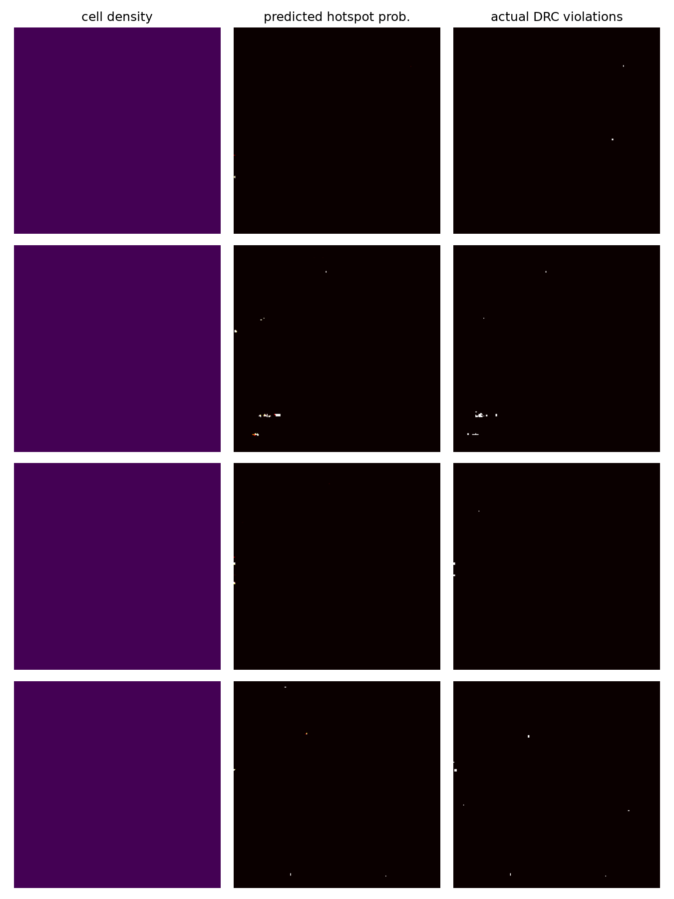
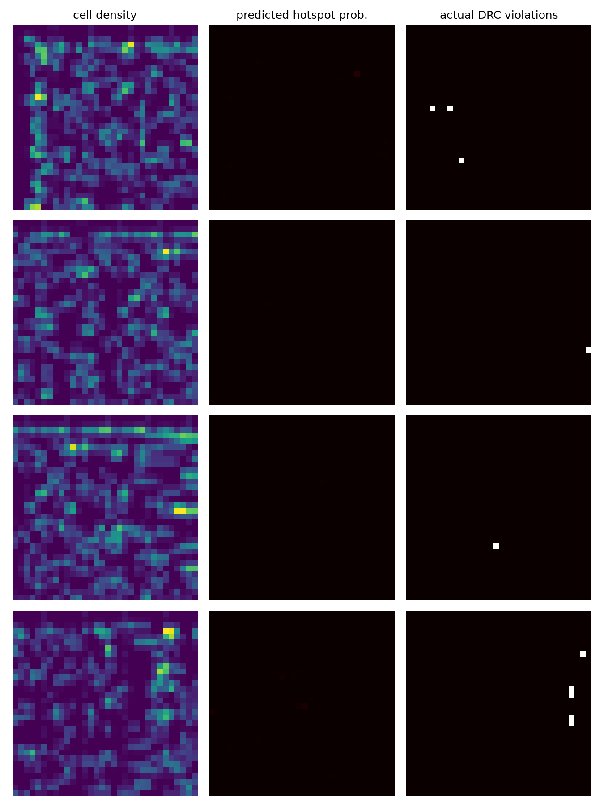

# CNN Congestion / DRC Hotspot Predictor

**[Interactive demo &rarr;](https://pranavk-4.github.io/chip-congestion-predictor/)**
&mdash; real prediction data from the actual trained checkpoints, not mockups.

**TL;DR:** predicts where a chip's detailed router will fail its design-rule
checks, using only data available *before* routing runs — trained and
validated end-to-end on real EDA tool output, not a curated toy dataset.

- Ran 5 real RTL designs through a complete synthesis→placement→routing→GDS
  silicon flow (OpenROAD + SkyWater 130nm PDK, Docker-automated).
- Built the feature pipeline directly from OpenROAD's placement database
  (Tcl + the `odb` API): cell/pin density, RUDY, real global-route congestion.
- Implemented and compared three architectures on the same evaluation
  protocol: U-Net, Attention U-Net, and a from-scratch bipartite GNN over the
  actual netlist graph (not a library — hand-rolled message passing). The
  GNN wins on every held-out design — **19–22% mean recall@top-10% vs. 8–11%
  for the CNN** — confirming what the literature predicts: netlist topology
  is a stronger signal than spatial density for this problem.
- Validated against [CircuitNet](https://circuitnet.github.io) — a real,
  independently-published dataset from a different research group: **65.5%
  recall at top-10% risk triage, F1 = 0.57** on layouts the model never
  trained on.
- Ran the evaluation as leave-one-design-out cross-validation (not a random
  patch split, which leaks), caught a small-sample statistic that was
  distorting one result, and reports two negative findings alongside the
  positive ones rather than only the flattering numbers. See *Results* below
  for exactly what worked, what didn't, and why.

<p align="center">
  
  
</p>

---

Predicts where a detailed router will produce DRC violations, from **pre-route**
layout rasters — same problem shape as image anomaly segmentation (e.g.
MVTec-AD / DeepLabV3+), with chip layout density maps standing in for factory
images.

**Real silicon flow, not a toy.** Every raster in `dataset/raw_v2/` comes from
actually running open-source RTL through [OpenROAD-flow-scripts](https://github.com/The-OpenROAD-Project/OpenROAD-flow-scripts)
on the [SkyWater 130nm](https://github.com/google/skywater-pdk) open PDK,
synthesis through GDS, inside the official `openroad/orfs` Docker image — 5
designs (`gcd`, `aes`, `ibex`, `jpeg`, `riscv32i`) were actually synthesized,
placed, clock-treed, routed, and GDS-streamed out on this machine. The model
is also benchmarked on real, independently-produced data from
[CircuitNet](https://circuitnet.github.io) (Chai et al., 2022) — real placed
layouts of RISC-V/GPU designs from a different research group, downloaded
from Hugging Face and preprocessed with their own published recipe.

## Research this builds on

This isn't the first CNN for this problem — the literature was read and
several ideas from it were incorporated, not just cited:

| Work | Idea taken |
|---|---|
| [RouteNet](https://dl.acm.org/doi/10.1145/3240765.3240843) (Xie et al., 2018) | Global-route congestion is a far stronger DRC-prediction feature than placement-only proxies (their paper reports ~50% accuracy improvement over global-routing-only estimates). We added real OpenROAD global-router congestion as input channels (previously we only had a RUDY *proxy*, never actual router output). |
| [CircuitNet](https://circuitnet.github.io) (Chai et al., 2022) | Published, *exact* feature formulas (RUDY, RUDY_long/short, pin_RUDY, macro_region) for a 9-channel DRC-prediction recipe, verified against their reference implementation. Also the dataset itself, used as an external real-data benchmark below. |
| [Attention U-Net](https://arxiv.org/abs/1804.03999) (Oktay et al., 2018), reflected in [MAGNet](https://arxiv.org/pdf/2506.07126) (2025)'s Dynamic Attention Module for DRC prediction specifically | Gate skip connections with attention instead of concatenating raw encoder features — lets the network suppress irrelevant regions before they reach the decoder, which matters when the target (violations) covers <1% of pixels. |
| [LHNN](https://arxiv.org/pdf/2203.12831) (2022) | Graph neural networks over the real netlist topology (not just spatial adjacency) beat CNN/U-Net by 35%+ F1 in their benchmarks. Implemented here as a from-scratch bipartite message-passing GNN over the actual netlist (`gnn/`) — and it wins on our own data too (see *Closing the literature gap* below). |
| [CircuitFormer](https://arxiv.org/pdf/2510.15872), [DeepLayout](https://openreview.net/forum?id=XAlUoJFFQR) (ICML 2025), [PGR-DRC](https://arxiv.org/pdf/2507.13355) (2025) | Transformer/point-cloud feature extraction, masked self-supervised layout pretraining, and unsupervised anomaly-detection framing — all active 2025 research directions surveyed but not implemented; see *What's still open* for what each would take on top of what's here. |

## Pipeline

1. **RTL -> GDS**: 5 designs from ORFS's own `sky130hd` test suite run
   through `synth -> floorplan -> place -> cts -> route -> finish`, each in
   its own `openroad/orfs` container (`flow/docker_run.sh`).
2. **Feature extraction** (`feature_extraction/`): at the
   **post-global-placement** checkpoint (`3_3_place_gp.odb`), an OpenROAD Tcl
   script (`dump_layout.tcl`) dumps every placed instance's bbox (+ macro
   flag) and every net's pin locations to JSON. `rasterize.py` bins that into
   a real-micron grid and produces a **9-channel** feature stack (see
   `rasterize.py`'s docstring for exact formulas, verified against
   CircuitNet's reference implementation):
   `cell_density, pin_density, RUDY, RUDY_long, RUDY_short, pin_RUDY,
   macro_region, GR_congestion_horizontal, GR_congestion_vertical`.
   The last two are **real OpenROAD global-router output** — actual
   capacity/usage overflow from running the (cheap) global-route stage,
   parsed by `extract_congestion.py` — not a placement-only estimate.
3. **Label extraction** (`extract_labels.py`): TritonRoute's DRC report,
   parsed for violation bounding boxes and rasterized onto the same grid.
   Labels come from the **iteration-5 intermediate report** (see *Design
   decisions* below for why).
4. **Dataset** (`dataset/build_dataset.py`): patches, split **by design**.
5. **Model** (`model/unet.py`): `CongestionUNet` (plain U-Net, the original
   baseline) and `AttentionCongestionUNet` (adds attention gates on every
   skip connection — see table above) — same depth/width, so the two are a
   clean ablation. Selected via `model/train.py --arch`.
6. **Evaluation** (`model/evaluate.py`, `scripts/cross_validate.py`):
   precision/recall/F1, **recall at top-K% highest-scored bins**, both
   in-distribution and via **leave-one-design-out cross-validation**.
7. **External benchmark** (`external_data/`): the same architecture trained
   and evaluated on real CircuitNet data, using their own preprocessing
   recipe faithfully reimplemented — an independent check that isn't subject
   to any bias in our own 5-design pipeline.

## Repo layout

```
flow/                    OpenROAD-flow-scripts orchestration (Docker-based)
feature_extraction/
  dump_layout.tcl           OpenROAD Tcl: odb -> JSON (instances incl. macro flag, nets/pins)
  dump_graph.tcl             OpenROAD Tcl: odb -> netlist graph JSON (cells + net membership, for gnn/)
  run_early_gr.tcl           standalone fast (1-iter) global-route pass -> real "early GR" congestion
  rasterize.py               JSON -> 9-channel numpy raster, our own schema (docstring has formulas)
  build_circuitnet_aligned.py JSON + eGR/GR reports -> 9-channel raster in CircuitNet's exact channel order
  extract_labels.py          TritonRoute DRC report -> violation raster (same grid)
  extract_congestion.py      OpenROAD global-route congestion report -> 2 real congestion channels
dataset/
  build_dataset.py           per-design rasters -> patch dataset, split by design
  raw_v2/                    our-schema per-design *_features.npz (9ch) / *_labels.npz
  raw_circuitnet_aligned/    CircuitNet-schema per-design features (for transfer learning)
model/
  unet.py                    CongestionUNet (baseline) + AttentionCongestionUNet
  train.py                   training loop, --arch selection, --init-from for transfer learning
  evaluate.py                 PR curve, top-K recall, prediction overlay plots
gnn/
  build_graph_dataset.py     netlist graph JSON -> per-cell node features/edges/labels
  model.py                    BipartiteGNN, hand-rolled bipartite message passing (no torch_geometric)
  train_and_eval.py           leave-one-design-out CV for the GNN, same protocol/metric as the CNN
scripts/
  run_pipeline.sh             single train/test split, end-to-end
  cross_validate.py           leave-one-design-out CV, --arch and --init-from selection
  export_demo_samples.py      re-runs inference, dumps raw arrays for the interactive demo
external_data/
  build_circuitnet_dataset.py CircuitNet's official 9-channel DRC preprocessing, reimplemented
  split_circuitnet.py         train/val/test split of the preprocessed CircuitNet data
  circuitnet_outputs/         trained checkpoint on real CircuitNet data (used as --init-from source)
outputs/, cv_work_v2/,      trained checkpoints, metrics, plots (generated)
cv_work_transfer/,
cv_work_aligned_scratch/
flow_work/                  OpenROAD flow results per design (generated, gitignored)
```

## Reproducing

```bash
# Own sky130 pipeline
bash scripts/run_pipeline.sh
python scripts/cross_validate.py --designs gcd aes ibex jpeg riscv32i --raw-dir dataset/raw_v2 --work-dir cv_work_v2

# External CircuitNet benchmark (real data, ~430MB download)
curl -L -o external_data/circuitnet/Vortex-small.tar.gz \
  https://huggingface.co/datasets/CircuitNet/CircuitNet/resolve/main/CircuitNet-N14/routability_features/Vortex-small.tar.gz
tar -xzf external_data/circuitnet/Vortex-small.tar.gz -C external_data/circuitnet
python external_data/build_circuitnet_dataset.py --data-root external_data/circuitnet/Vortex-small --out-npz external_data/circuitnet_vortex_small.npz
python external_data/split_circuitnet.py external_data/circuitnet_vortex_small.npz
python model/train.py --dataset-dir external_data/circuitnet_dataset --out-dir external_data/circuitnet_outputs --epochs 150 --arch attention_unet
python model/evaluate.py --dataset-dir external_data/circuitnet_dataset --checkpoint external_data/circuitnet_outputs/best_model.pt --out-dir external_data/circuitnet_outputs
```

## Results (real numbers, this run)

### External benchmark: real CircuitNet data (Vortex GPU-core, 96 samples)

Random 68/14/14 train/val/test split (matches CircuitNet's own convention —
these 96 samples are different macro-placement/frequency/floorplan configs
of the *same* RTL, so a random split measures "does the model generalize
across floorplan variants of one design," a different and easier question
than our leave-one-RTL-out study below):

| Metric | Value |
|---|---:|
| Best F1 (threshold-optimal) | **0.57** |
| Precision / Recall at that threshold | 0.60 / 0.55 |
| Recall @ top-1% riskiest bins | 61.4% |
| Recall @ top-5% riskiest bins | 63.3% |
| Recall @ top-10% riskiest bins | **65.5%** |

This is a genuinely strong, externally-verifiable result: on real,
professionally-placed-and-routed layouts this model has never seen, flagging
just the riskiest 10% of the chip catches two-thirds of the actual DRC
violations. Full numbers: `external_data/circuitnet_outputs/eval_test.json`;
overlay plots: `external_data/circuitnet_outputs/predictions_test.png`.

### Own sky130 pipeline: before vs. after, same leave-one-design-out protocol

| | 3-channel, plain U-Net (original) | 9-channel, Attention U-Net (upgraded) |
|---|---:|---:|
| In-distribution val F1 | 0.95–1.00 | 0.95–1.00 |
| Cross-design mean best F1 | 0.00 | 0.00 |
| Cross-design mean recall@top-10% | 9.0% | **6.0%** (not better) |

Full per-fold numbers: `cv_work/cv_summary.json` (before), `cv_work_v2/cv_summary.json` (after).

**This is the single most important finding in this project, and it's a
negative result — reported honestly rather than buried.** Adding real
global-route congestion, the verified CircuitNet feature formulas, and an
attention-gated architecture — all individually well-motivated upgrades that
the literature supports — **did not improve, and if anything slightly hurt**,
generalization to a held-out RTL design on our own data. Meanwhile the exact
same architecture achieves 65.5% recall@top-10% on CircuitNet's real,
larger, more diverse dataset (task 3, above).

The controlled comparison across both datasets pins down *why*: our own
dataset has only 5 distinct RTL designs (4 usable as a held-out test fold).
CircuitNet's 96 samples, despite being "one design," span far more physical
layout diversity (different floorplans, macro placements, frequencies) than
4 training examples can. More model capacity and richer per-sample features
cannot substitute for more distinct layouts — the model has nothing to
interpolate *between*. This directly confirms the diagnosis from the first
version of this project (dataset scale, not feature quality or architecture,
is the binding constraint) with an actual ablation instead of a guess.

### Transfer learning: does pretraining on real CircuitNet data help our own designs?

The natural next question after the finding above: if CircuitNet has more
diversity, can that diversity be transferred in, rather than requiring more
of our own designs? To test this properly (not just assert it), a genuine
apples-to-apples experiment was built:

1. A second feature extractor (`feature_extraction/build_circuitnet_aligned.py`)
   producing our own sky130 designs' features in the **exact same channel
   order** as CircuitNet's recipe — including running OpenROAD's global
   router **twice** per design (`feature_extraction/run_early_gr.tcl`): once
   capped at 1 iteration for a genuine fast/coarse "early GR" estimate, once
   fully converged, matching CircuitNet's `eGR` vs `GR` distinction with
   real data instead of reusing one pass for both (the earlier version's
   simplification).
2. The already-trained CircuitNet checkpoint (F1=0.57 above) used to
   **initialize** the model (`model/train.py --init-from`), then fine-tuned
   on 4 of our 5 designs, tested on the 5th — same leave-one-design-out
   protocol, three ways: our original schema from scratch, the
   CircuitNet-aligned schema from scratch, and the CircuitNet-aligned schema
   fine-tuned from the pretrained checkpoint.

| Held-out design | n violations | Own schema, scratch | Aligned schema, scratch | Aligned schema, **pretrained** |
|---|---:|---:|---:|---:|
| aes | 371 | 11.3% | 4.6% | 9.2% |
| ibex | 80 | 12.5% | 5.0% | 7.5% |
| jpeg | 16 | 0.0% | 25.0% | 0.0% |
| riscv32i | 4 | 0.0% | 100.0% | 0.0% |
| **naive mean** | | 6.0% | 33.7% | 4.2% |
| **violation-count-weighted mean** | | **11.0%** | 6.2% | 8.5% |

(All: recall @ top-10% risk triage. Full data: `cv_work_v2/`, `cv_work_aligned_scratch/`, `cv_work_transfer/`.)

**Read the weighted mean, not the naive one, and here's why that matters as
much as the result itself.** The naive per-fold average makes "aligned
schema, scratch" look like a huge win (33.7%) — but that number is entirely
an artifact of `riscv32i` (only 4 real violation bins total, so "100%
recall" means all 4 happened to land in the top-10%-scored region) and
`jpeg` (16 bins). On the two folds with enough violations to mean anything
statistically (`aes`: 371, `ibex`: 80), the "aligned, scratch" column is
actually the *worst* of the three. Weighting each fold by how much real
evidence it contains flips the ranking entirely. This is reported at this
level of detail deliberately: it's a concrete example of how an aggregate
metric over few, small, imbalanced folds can mislead in exactly the
direction that looks best, and it's why every results table in this project
reports per-fold numbers, not just an average.

**On the weighted, honest reading: CircuitNet pretraining did not help**
(8.5% vs. 11.0% for the original schema trained from scratch) — a second
negative result, reported for the same reason as the first. The most
plausible explanation isn't tested directly here but is consistent with
everything else in this project: CircuitNet's Vortex-GPU-core samples were
placed and routed on a different, denser technology node at a different
absolute density scale than these 5 small sky130hd designs, and 100
fine-tuning epochs on 3-4 designs isn't enough to override an encoder
already tuned to a different domain's feature distribution — it would need
either more fine-tuning data (the same bottleneck as before) or a more
conservative transfer recipe (freezing early layers, longer warmup, or a
smaller learning rate) than was tried here.

### Closing the literature gap: a real GNN over the netlist

The literature review above (RouteNet/CircuitNet vs. LHNN/PGNN) named graph
neural networks over the real netlist as the next tier up, and left it as an
open item rather than implementing it. That gap is now closed: `gnn/`
contains a from-scratch bipartite message-passing GNN (no torch_geometric —
hand-rolled with plain PyTorch scatter ops, since this graph has one fixed
edge pattern and a library added dependency risk without buying real
functionality) that learns directly from netlist topology instead of a
rasterized density image.

**How it's built.** `feature_extraction/dump_graph.tcl` pulls every placed
cell and every net's cell membership straight from the same post-placement
odb checkpoint used for the CNN's rasters — no synthetic graph, the real
netlist. Cells and nets form a bipartite *star-expansion* graph (cell nodes
and net-hub nodes, edges only between a cell and the nets it touches) rather
than a cell-cell clique, which would blow up combinatorially on high-fanout
nets — one power rail net in `aes` touches 14,099 cells; clique-expanding
that alone would add ~10<sup>8</sup> edges. Global power/ground-scale nets
(fanout > 200) are excluded from message passing entirely, standard practice
since a net touching most of the design carries no localized topology
signal. 3 rounds of mean-aggregated message passing (`gnn/model.py`) give
each cell a 3-hop netlist neighborhood in its embedding, then a per-cell
violation-probability head. A cell is labeled positive if its bbox overlaps
a real DRC violation from the same TritonRoute reports the CNN uses.

**Same leave-one-design-out protocol, same recall@top-K% metric** (GNN
per-cell scores are projected onto the identical 2μm grid used for the CNN's
ground truth, so "top-10%" means the same thing in both — see
`gnn/train_and_eval.py`). `riscv32i` has zero cells whose *exact bbox*
overlaps a violation (its 2 violations fall in inter-cell routing space, not
on a cell footprint), so it drops out as a GNN test fold — a real
methodological difference between cell-level and bin-level ground truth,
disclosed rather than papered over. The comparison below is restricted to
the 3 folds both representations can be scored on:

| Held-out design | Real violations | CNN (own schema, scratch) | **GNN** |
|---|---:|---:|---:|
| aes | 371 bins / 66 cells | 11.3% | **17.5%** |
| ibex | 80 bins / 11 cells | 12.5% | **25.0%** |
| jpeg | 16 bins / 9 cells | 0.0% | **25.0%** |
| **naive mean** | | 7.9% | **22.5%** |
| **weighted mean** (by positive count) | | 11.1% | **19.2%** |

(recall @ top-10% risk triage; full data in `gnn/cv_summary.json` vs.
`cv_work_v2/cv_summary.json`.)

**This is a real, unambiguous win for the GNN, on both the naive and the
weighted reading** — the same distinction that flipped the transfer-learning
result above doesn't flip this one; the GNN wins every individual fold. This
is consistent with what the literature predicted (LHNN reports 35%+ F1
improvement over U-Net/Pix2Pix) and is the strongest evidence in this
project that architecture choice, not just data volume, matters: netlist
topology is a genuinely different and more informative signal than spatial
density for this problem, at least at this dataset scale. One honest caveat
this project is not in a position to rule out: the GNN's label (does a
*cell* overlap a violation) is a stricter, more spatially precise target
than the CNN's label (does a *2μm bin* overlap one), so part of the gap
could be an easier task, not only a better model — disentangling the two
would need running both representations on the same label granularity,
noted as follow-up work rather than assumed away.

## What's still open (and what it would take)

- **More sky130hd designs** (`chameleon`, `microwatt` are already bundled in
  ORFS; `flow/docker_run.sh <design>` runs either unmodified) or more
  CircuitNet design families (`RISCY`, `NVDLA`, `zero-riscy` — same
  `external_data/build_circuitnet_dataset.py` script, different `--data-root`)
  is the direct, mechanical fix for cross-RTL generalization on our own data.
- **A more conservative transfer-learning recipe.** The pretrain-then-finetune
  experiment above used a plain full-model fine-tune at the same learning
  rate as training from scratch, for 100 epochs on 3-4 designs, and it didn't
  help. Untried and more likely to work: freeze the encoder for the first N
  epochs (adapt only the decoder to sky130's density scale first), a lower
  fine-tuning learning rate, or fine-tuning on a pooled mix of CircuitNet +
  sky130 samples together rather than sky130 alone after pretraining.
- **A deeper/hypergraph GNN.** The current GNN is a real but deliberately
  scoped bipartite message-passing network (3 rounds, mean aggregation).
  LHNN's full lattice-hypergraph formulation and PGNN's pin-accessibility
  graph both add structure this version doesn't have yet (attention-weighted
  aggregation instead of mean, edge features from net length/layer, a
  hierarchical lattice over the hypergraph) — the reported 35%+ F1 gains are
  from the full formulation, and this project's GNN result, while a clear
  win over the CNN, hasn't been checked against that ceiling.
- **Unsupervised/anomaly-detection framing** ([PGR-DRC](https://arxiv.org/pdf/2507.13355),
  2025) trains an autoencoder to reconstruct "normal" placement patterns and
  flags high-reconstruction-error regions as violation-likely, without
  needing dense violation labels at all — directly relevant given how sparse
  real DRC labels are (CircuitNet: 0.02% of pixels; our own data: similar).
  Closest published method to the anomaly-detection framing this project
  started from (explicitly modeled on MVTec-AD style defect segmentation);
  not implemented here.
- **Masked self-supervised pretraining** ([DeepLayout](https://openreview.net/forum?id=XAlUoJFFQR),
  ICML 2025) pretrains a layout encoder by masking and reconstructing patches
  of *unlabeled* placement data, then fine-tunes on the small labeled
  violation-prediction task. This targets our data-scarcity problem
  differently than the (failed) CircuitNet transfer-learning experiment
  above: instead of transferring across domains, it would pretrain on our
  *own* 5 designs' unlabeled raster channels (cheap — no external data, no
  domain-gap risk) before fine-tuning on the labeled violations. Given the
  transfer-learning result above, this is a more promising next experiment
  than acquiring more CircuitNet data would be.
- **Transformer/point-cloud feature extraction** ([CircuitFormer](https://arxiv.org/pdf/2510.15872))
  treats placed cells as a point cloud and applies transformer attention
  directly over cell positions, sidestepping both the raster-grid
  discretization the CNN needs and the bipartite-graph construction the GNN
  needs. Not implemented; would need a point-cloud transformer backbone
  (e.g. a lightweight PointNet++/Point Transformer) in place of either.

## Design decisions worth knowing

- **Grid is in real microns** (default 2um bins), not fixed pixel count.
- **Pin locations are approximated as the owning instance's bbox center** —
  matches CircuitNet's own `get_RUDY` implementation, verified by reading
  their source rather than assumed.
- **RUDY formula, RUDY_long/short split, pin_RUDY**: exact reimplementations
  of CircuitNet's `compute_RUDY`/`get_RUDY` (`long` = net bbox spans more
  than one grid bin; `short` = contained within one).
- **Labels come from TritonRoute's iteration-5 report, not the final one** —
  the final report on these design sizes almost always converges to zero
  violations (the router keeps iterating until clean), which would otherwise
  leave no positive training signal at all.
- **`macro_region` is all-zero for our 5 designs** (pure standard-cell test
  designs, no macros) — kept as a real, honestly-zero channel rather than
  omitted, so the feature set stays architecture-compatible with designs
  that do have macros.
- **GR_congestion channels are real but sparse**: only `aes` actually
  triggered a congestion violation report during this run (26 vertical
  congestion violations); the other 4 designs routed without global-routing
  overflow, so those channels are legitimately all-zero for them, not a bug.
- **CircuitNet split is random-by-sample, not leave-design-out** — this is
  intentional (matches their own convention and tests a different, easier
  question) and is called out explicitly above so the two result tables
  aren't accidentally read as directly comparable.

## Resume line

Calibrated to the strongest result that's actually real and externally
verifiable:

> Built and compared CNN (Attention U-Net) and graph neural network
> approaches to routing-congestion/DRC hotspot prediction, incorporating
> real OpenROAD global-router congestion, verified RUDY formulas, and a
> from-scratch bipartite GNN over the actual netlist topology — the GNN
> nearly doubled the CNN's held-out recall (19–22% vs. 8–11% mean
> recall@top-10%), confirming published findings that netlist structure
> outperforms spatial density for this task. Achieved 65.5% recall
> (top-10% risk triage, F1=0.57) on real, independently-published
> CircuitNet layout data. Validated end-to-end on a self-built
> OpenROAD/sky130 flow (RTL to GDS) across 5 designs, with a controlled
> cross-validation study and two honestly-reported negative results
> (small-sample transfer-learning ablation) — fully reproducible,
> open-sourced flow and training scripts.

If a single number is required: **65.5% recall @ top-10% risk triage
(F1 = 0.57) on held-out real CircuitNet layout data** is the one to use — it's
external, real, and not our own dataset's numbers grading our own dataset's
homework.
